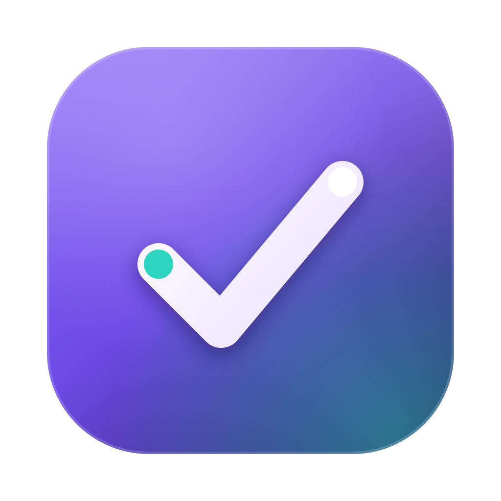

<div align="center">



# Alex Tracker

**A local-first desktop command center for your work and life.**

Notes · To-Dos · Habits · Calendar · Daily Journal · Goals · Projects (with time tracking) · Business Finance · Personal Finance

Built with **Tauri 2 · React · TypeScript · SQLite** — your data never leaves your device.

</div>

---

## ✨ Highlights

- **One app for everything** — capture a note, plan a task, log your day, track a habit, run your projects, and manage money in a single place.
- **Local-first & private** — all data is stored on your machine in a single SQLite database. No account, no cloud, no internet required.
- **Feels like a native app** — custom title bar, system tray, global quick-capture hotkey, alarm-style reminders, themed pickers, and sound effects. No browser chrome.
- **Business *and* personal finance** — per-project P&L for your work, plus a separate Personal area with wallets, budgets, and recurring bills.

## 📸 Screenshots

> Drop your screenshots into `screenshots/` and they'll show up here.

| Dashboard | Calendar | Finance |
|---|---|---|
|  |  |  |

| Projects | Personal | Notes |
|---|---|---|
|  |  |  |

## 🧩 Features

**Dashboard** — greeting, today's progress bar with quick-add, weekly completion chart, mood, up-next tasks, habits, and recent notes.

**Notes** — board (sticky-note) & list views, colors, pins, tags, Markdown with a formatting toolbar + live preview, paste-images-to-disk, and templates (meeting notes, journal, weekly review, project brief, idea).

**To-Dos** — priorities, due dates, projects, reminders, grouped by Overdue/Today/Upcoming, full editing, and bulk actions (multi-select → done / move / delete).

**Calendar** — month grid with color-coded task pills, right-click a day to add task / set reminder / write log, click any task to edit it, and a day detail panel.

**Habits** — daily habit tracker with a 14-day grid, streaks, and monthly counts.

**Daily Log** — one journal entry per day with a mood selector and a journaling streak.

**Goals** — quarterly/yearly objectives with progress, status, and deadline countdown.

**Projects (Focus Mode)** — per-project workspace with tabs for Overview, Tasks, Notes, Finances, and Time; pin & drag-to-reorder; start a focus timer that logs time to the project.

**Finance (business)** — available-balance hero with trend, today's P&L vs yesterday, monthly income/expenses/savings rate, income-vs-expense bar chart, spending & income donuts, and per-project performance. Multi-currency with locale-correct formatting.

**Personal finance** — wallets/accounts (cash, bank, e-wallets) with balances and transfers, monthly budgets per category with progress bars, and recurring bills with due reminders and a monthly total.

**Reminders** — set an exact time; when due it rings an alarm chime, pops a focus window (even from the tray), and sends a native notification. Snooze / Done.

**Settings** — accent themes, currency, sound toggle, automatic backups to a folder of your choice, JSON export, and erase-all.

## 🛠️ Tech stack

- **[Tauri 2](https://tauri.app)** — Rust-powered native shell (~10 MB, not Electron)
- **React + TypeScript + Vite** — frontend
- **SQLite** via `tauri-plugin-sql` — local storage
- Plugins: notification, global-shortcut, fs, dialog, window-state, single-instance
- Custom UI components, [lucide](https://lucide.dev) icons, `marked` for Markdown

## 🚀 Getting started

### Prerequisites
- [Node.js](https://nodejs.org) 18+
- [Rust](https://rustup.rs) (stable)
- Windows: the [WebView2 runtime](https://developer.microsoft.com/microsoft-edge/webview2/) (preinstalled on Windows 11)

### Run in development
```bash
npm install
npm run tauri dev
```

### Build a release (.exe / installer)
```bash
npm run tauri build
```
Output:
- `src-tauri/target/release/my-tracker.exe` — the app
- `src-tauri/target/release/bundle/nsis/*-setup.exe` — installer
- `src-tauri/target/release/bundle/msi/*.msi` — MSI installer

## ⌨️ Shortcuts

| Shortcut | Action |
|---|---|
| `Ctrl/⌘ + K` | Global search |
| `Ctrl/⌘ + N` | Quick capture |
| `Ctrl/⌘ + Shift + Space` | Quick capture (system-wide) |
| `Esc` | Close any modal / menu |

## 🔐 Data & privacy

Everything lives locally:
- `tracker.db` (SQLite) in the app-data folder holds all notes, tasks, finances, etc.
- Pasted images are saved under an `images/` folder in app data.

Back it up with **Settings → Auto-backup** (writes JSON to a folder you pick — point it at OneDrive/Google Drive for free off-site backup) or **Export backup**.

## 📁 Project structure

```
src/                 React frontend
  pages/             Dashboard, Notes, Todos, Calendar, Habits,
                     DailyLog, Goals, Projects, ProjectDetail,
                     Finance, Personal, Settings
  components/        TitleBar, Select, ComboBox, DatePicker,
                     TimePicker, ContextMenu, Markdown, Charts…
  db.ts              SQLite schema + migrations
  time.ts            WIB (Asia/Jakarta) date helpers
  sounds.ts          synthesized UI sounds + alarm
src-tauri/           Rust shell, plugins, icons, config
```

See [FEATURES.md](FEATURES.md) for the full feature reference.
